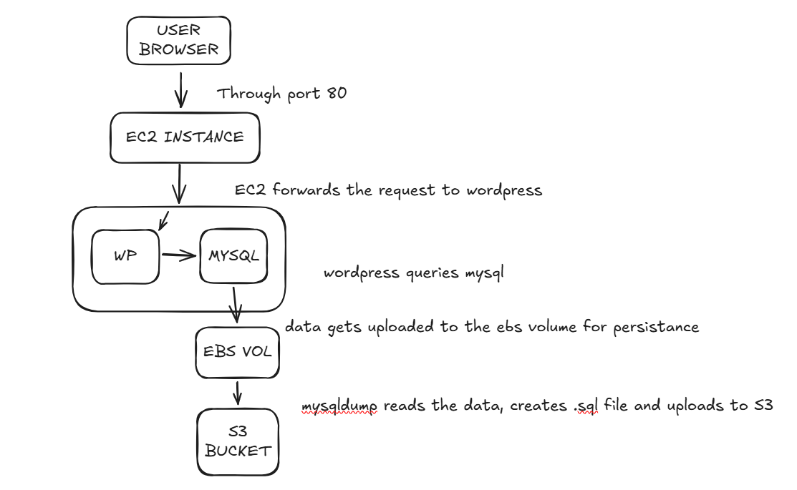

# Architecture Document

Create a short document called architecture.md (1–2 pages) that explains your deployment. This is not a step-by-step guide of what you did. It is an explanation of why you made the choices you made.

In this project, i deployed a two-tier web application, Wordpress and MySQL, using bashscripting, Docker containers and EC2 instance. The document explains why and what I did, the tradeoffs and possibly security fail points.

The deployment includes the following AWS services:

 -Amazon Elastic Compute Cloud (EC2) which hosts the Docker containers
 -Amazon Elastic Block Store (EBS) which provides persistent storage for the MySQL database
 -Amazon Simple Storage Service (S3) which stores database backups
 -A backup.sh script, that uploads my database data to my S3 bucket
 -A provision.sh script, that sets up everything I need such as the folders, installing docker, aws cli etc.
 -A .env file to store my sensitive data
 -A docker-comose yml file to start up my wordpress and mySQL containers

I start the application using Docker Compose, which manages the WordPress and MySQL containers and allows them to communicate over an internal Docker network.

## The Application Flow
How the components connect: User → EC2 instance → Docker → WordPress + MySQL → EBS volume

A user accesses the website using a browser through HTTP (port 80) → The request reaches the EC2 instance → The request is forwarded to the WordPress container running inside Docker → WordPress queries the MySQL container for application data → MySQL stores its database files on the mounted EBS volume (/mnt/mysql-data) → The backup script exports the database using mysqldump → The backup file is uploaded to an S3 bucket for safe storage.

## To address the following questions

### Why is an EBS volume used for MySQL data instead of letting the container store it internally? What would happen without it?
The MySQL container stores data in /var/lib/mysql. If this container gets shut down, the data, currently stored in its filesystem will be lost. Using an  EBS volume ensures that Database data persists even if containers restart. Also, the storage can be detached and attached to another instance if necessary.

### Which ports did you open in your security group, and why those specific ports? Are there any security risks with your current configuration?
I opened Port 22 which allows me to remotely access and configure the web-app server.
Opening it to 0.0.0.0/0 allows SSH access from anywhere. This poses a security as anyone can access this and make changes we don't approve of. It's better to allows access only to trusted IP addresses. 

I opened Port 80 to allow users to aaccess the Web-app from the browser. A better option would be Https - which is the secured version of Http. this allows access to the website securely over the browser.

### What would break if your EC2 instance crashed right now? What data would survive and what would be lost?
If the EC2 instance crashed, Data that would survive include: MySQL database stored on the EBS volume and Backup files stored in S3.

Data that would be lost include: the two running containers and any data currently stored on their filesystem, like log files.
Should the application be restored by launching a new EC2 instance and redeploying the Docker containers, the existing EBS volume can be reattached to the new instance.

### If this application needed to handle 100x more users, what would you change? (It is perfectly fine to say you do not know yet, but try to think it through.)
If the application needed to support significantly more users, we can spin up more instances to handle the load. Then use a load balancer to handle/direct this traffic to the healthy instances. Changes can also be made to the database storage - I don't really know much about the storage options available
With these changes, I'm sure the new traffic can be handled well.